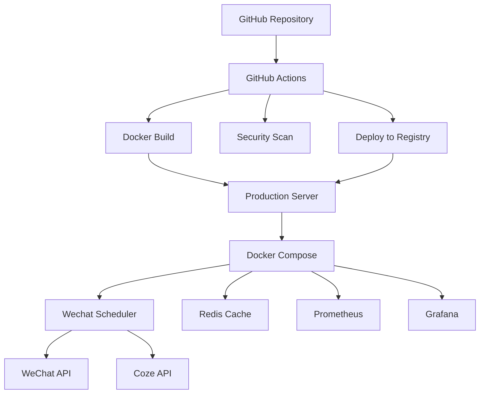

# 微信公众号定时服务

[](https://github.com/yourusername/wechat-scheduler/actions/workflows/ci-cd.yml)
[](https://github.com/yourusername/wechat-scheduler/actions/workflows/docker.yml)
[](https://nodejs.org/)
[](https://opensource.org/licenses/MIT)

一个生产级的微信公众号定时服务，基于 Coze API 的自动化定时任务系统，支持 Docker 容器化部署和完整的 CI/CD 流程。

## ✨ 特性

- 🔄 **自动化定时任务**：支持自定义 cron 表达式
- 🐳 **Docker 容器化**：多阶段构建，优化镜像大小
- 🚀 **CI/CD 自动化**：GitHub Actions 完整工作流
- 📊 **监控与日志**：Winston 日志系统 + Prometheus + Grafana
- 🔧 **生产级配置**：PM2 进程管理 + systemd 服务
- 🛡️ **安全最佳实践**：环境变量管理 + 代码规范检查
- 📦 **多环境支持**：开发、测试、生产环境分离

## 🏗️ 架构图



## 🚀 快速开始

### 前置要求

- Node.js >= 16.0.0
- Docker >= 20.0.0
- Docker Compose >= 2.0.0

### 一键启动

```bash
# 克隆项目
git clone https://github.com/yourusername/wechat-scheduler.git
cd wechat-scheduler

# 运行启动脚本
./start.sh
```

启动脚本会自动：
- 检查环境依赖
- 配置环境变量
- 安装项目依赖
- 选择启动方式（Node.js / PM2 / Docker / Docker Compose）

### 手动配置

#### 1. 配置环境变量

```bash
# 复制环境变量模板
cp .env.example .env

# 编辑配置文件
nano .env
```

配置以下必需参数：

```env
# 微信公众号配置
WECHAT_APPID=your_wechat_appid_here
WECHAT_SECRET=your_wechat_secret_here

# Coze API配置
COZE_AUTH_TOKEN=your_coze_auth_token_here

# 定时任务配置
SCHEDULE_TIME=0 0 8 * * *  # 每天8:00执行
AUTO_PUBLISH=false
```

#### 2. 安装依赖

```bash
npm install
```

#### 3. 启动服务

**直接运行**
```bash
node wechat-scheduler.js
```

**PM2 管理**
```bash
npm run pm2:start
```

**Docker 运行**
```bash
docker-compose up -d
```

## 🐳 Docker 部署

### 开发环境

```bash
docker-compose -f docker-compose.yml -f docker-compose.dev.yml up -d
```

### 生产环境

```bash
# 使用生产环境配置
docker-compose -f docker-compose.yml -f docker-compose.prod.yml up -d
```

### 监控服务

```bash
# 启动完整监控栈
docker-compose up -d

# 访问监控面板
# Prometheus: http://localhost:9090
# Grafana: http://localhost:3001 (admin/admin123)
```

## 🚀 CI/CD 流程

### GitHub Actions 工作流

#### 1. CI Pipeline
- **代码检查**：ESLint + Prettier
- **安全扫描**：npm audit + CodeQL
- **多版本测试**：Node.js 16, 18, 20
- **构建验证**：应用构建测试

#### 2. Docker Build
- **多平台构建**：linux/amd64 + linux/arm64
- **镜像优化**：多阶段构建 + 缓存优化
- **安全扫描**：容器镜像安全检查
- **自动推送**：GHCR 镜像仓库

#### 3. 自动部署
- **分支策略**：
  - `main` → 生产环境
  - `develop` → 测试环境
  - `feature/*` → 功能分支（仅 CI）
- **部署验证**：健康检查 + 回滚机制

### 使用说明

1. **推送代码**：代码推送到 GitHub
2. **自动触发**：GitHub Actions 自动运行
3. **构建镜像**：Docker 镜像自动构建并推送到 GHCR
4. **部署服务**：根据分支自动部署到对应环境

## 📊 监控与运维

### 健康检查

```bash
# 应用健康状态
curl http://localhost:3000/health

# 应用信息
curl http://localhost:3000/
```

### 日志管理

```bash
# 查看应用日志
docker-compose logs -f wechat-scheduler

# PM2 日志
pm2 logs wechat-scheduler

# 文件日志
tail -f logs/combined.log
```

### 性能监控

- **Prometheus**：指标收集和告警
- **Grafana**：可视化监控面板
- **健康检查**：自动故障检测
- **日志聚合**：结构化日志记录

### 运维脚本

#### 生产部署

```bash
# 自动部署脚本
./deploy.sh -e production -b v1.0.0

# 参数说明
# -e, --env ENV           部署环境
# -b, --build BUILD       构建版本号
# --backup-dir DIR        备份目录
# --app-dir DIR           应用目录
```

#### 服务管理

```bash
# 重启服务
pm2 restart wechat-scheduler

# 停止服务
pm2 stop wechat-scheduler

# 删除服务
pm2 delete wechat-scheduler

# 查看状态
pm2 status
```

## 🛠️ 开发指南

### 代码规范

```bash
# 代码检查
npm run lint

# 自动修复
npm run lint:fix

# 代码格式化
npm run format

# 格式检查
npm run format:check
```

### 测试

```bash
# 运行测试
npm test

# 测试覆盖率
npm run test:coverage
```

### 项目结构

```
wechat-scheduler/
├── .github/workflows/     # GitHub Actions 工作流
├── monitoring/           # 监控配置
├── src/                  # 源代码
├── logs/                 # 日志文件
├── .env.example          # 环境变量模板
├── Dockerfile            # Docker 构建文件
├── docker-compose.yml    # Docker Compose 配置
├── ecosystem.config.js   # PM2 配置
├── start.sh              # 启动脚本
├── deploy.sh             # 部署脚本
└── package.json          # 项目配置
```

## 🔧 配置选项

### 环境变量

| 变量名 | 必需 | 默认值 | 描述 |
|--------|------|--------|------|
| `WECHAT_APPID` | ✅ | - | 微信公众号 AppID |
| `WECHAT_SECRET` | ✅ | - | 微信公众号 Secret |
| `COZE_AUTH_TOKEN` | ✅ | - | Coze API 认证令牌 |
| `SCHEDULE_TIME` | ❌ | `0 0 8 * * *` | 定时任务表达式 |
| `AUTO_PUBLISH` | ❌ | `false` | 是否自动发布 |
| `LOG_LEVEL` | ❌ | `info` | 日志级别 |
| `NODE_ENV` | ❌ | `production` | 运行环境 |

### 定时任务表达式

```bash
# 每天8点执行
SCHEDULE_TIME=0 0 8 * * *

# 工作日9点执行
SCHEDULE_TIME=0 0 9 * * 1-5

# 每小时执行
SCHEDULE_TIME=0 0 * * * *

# 每30分钟执行
SCHEDULE_TIME=*/30 * * * *
```

## 🐛 故障排除

### 常见问题

#### 1. 微信 Access Token 获取失败

```bash
# 检查环境变量
echo $WECHAT_APPID
echo $WECHAT_SECRET

# 检查网络连接
curl -I https://api.weixin.qq.com/cgi-bin/token
```

#### 2. Coze API 调用失败

```bash
# 检查认证令牌
echo $COZE_AUTH_TOKEN

# 测试 API 连接
curl -H "Authorization: Bearer $COZE_AUTH_TOKEN" \
     -H "Content-Type: application/json" \
     -X POST https://2kkf772qbd.coze.site/run \
     -d '{"test": true}'
```

#### 3. 容器启动失败

```bash
# 查看容器日志
docker-compose logs wechat-scheduler

# 进入容器调试
docker-compose exec wechat-scheduler sh

# 检查端口占用
netstat -tulpn | grep 3000
```

#### 4. 定时任务不执行

```bash
# 检查 cron 表达式
node -e "console.log(require('node-cron').validate('0 0 8 * * *'))"

# 查看定时任务日志
docker-compose logs | grep "cron"
```

### 日志分析

```bash
# 错误日志
tail -f logs/error.log

# 组合日志
tail -f logs/combined.log

# 实时监控
docker-compose logs -f --tail=100
```

## 📝 更新日志

### v1.0.0 (2024-01-01)
- ✨ 初始版本发布
- 🚀 支持 Docker 容器化部署
- 📊 集成监控和日志系统
- 🔄 完整的 CI/CD 流程
- 🛡️ 生产级安全配置

## 📄 许可证

本项目采用 [MIT 许可证](LICENSE)。

## 🤝 贡献

欢迎提交 Issue 和 Pull Request！

1. Fork 项目
2. 创建特性分支 (`git checkout -b feature/AmazingFeature`)
3. 提交更改 (`git commit -m 'Add some AmazingFeature'`)
4. 推送到分支 (`git push origin feature/AmazingFeature`)
5. 打开 Pull Request

## 📞 支持

- 📧 邮箱：support@example.com
- 💬 讨论：[GitHub Discussions](https://github.com/yourusername/wechat-scheduler/discussions)
- 🐛 问题：[GitHub Issues](https://github.com/yourusername/wechat-scheduler/issues)

## 🙏 致谢

- [Node.js](https://nodejs.org/) - 运行环境
- [Docker](https://www.docker.com/) - 容器化平台
- [GitHub Actions](https://github.com/features/actions) - CI/CD 平台
- [PM2](https://pm2.keymetrics.io/) - 进程管理
- [Winston](https://github.com/winstonjs/winston) - 日志系统
- [Prometheus](https://prometheus.io/) - 监控平台
- [Grafana](https://grafana.com/) - 可视化平台